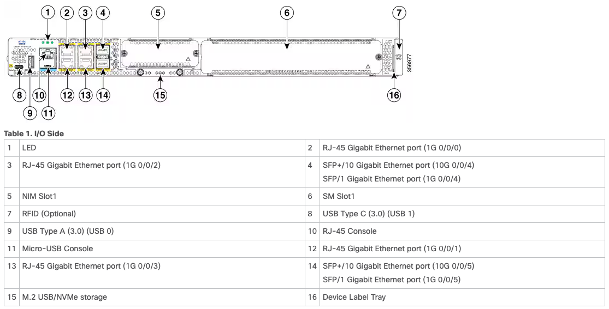
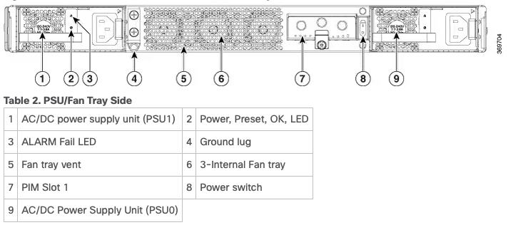
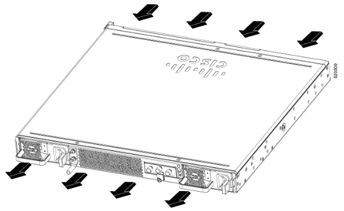

# Table of Contents
* [Reference](#reference)
* [Hardware chassis overview](#hardware-chassis-overview)
  * [Front Chassis](#front-chassis)
  * [Back Chassis](#back-chassis)
  * [Airflow](#airflow)
* [Interfaces](#interfaces)

---

# Reference

> [Hardware Installation Guide for Cisco Catalyst 8300 Series Edge Platforms](https://www.cisco.com/c/en/us/td/docs/routers/cloud_edge/c8300/hardware_installation/b-catalyst-8300-series-edge-platforms-hig/m-overview.html)
>
> [Load PDF](./b-catalyst-8300-series-edge-platforms-hig.pdf)


# Hardware chassis overview

## Front Chassis


## Back Chassis


## Airflow
- [x] Front to back
- [ ] Back to Front
- [ ] Side to Side



# Interfaces
```config
interface GigabitEthernet0/0/0
 ip vrf forwarding mgmt-vrf
 negotiation auto
!
interface GigabitEthernet0/0/1
 no ip address
 negotiation auto
!
interface GigabitEthernet0/0/2
 no ip address
 negotiation auto
!
interface GigabitEthernet0/0/3
 no ip address
 negotiation auto
!
interface TenGigabitEthernet0/0/4
 no ip address
 negotiation auto
!
interface TenGigabitEthernet0/0/5
 no ip address
 negotiation auto
!
interface TenGigabitEthernet0/1/0
!
interface TenGigabitEthernet0/1/1
!
interface TenGigabitEthernet0/1/2
 switchport
!
interface TenGigabitEthernet0/1/3
 switchport
!
interface Vlan1
 no ip address
