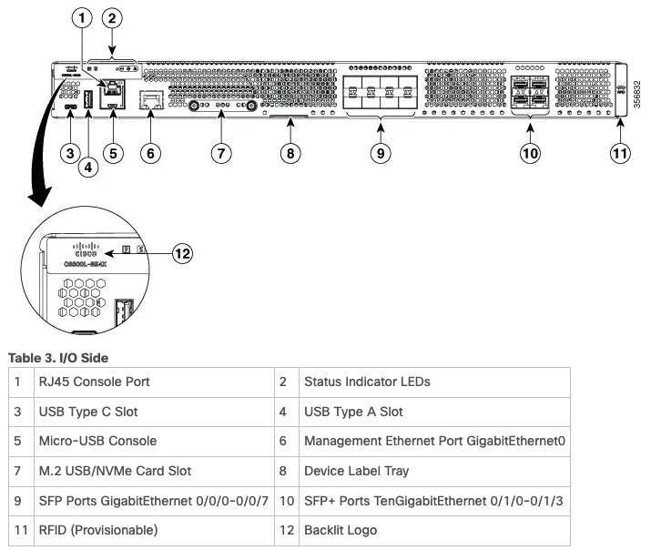
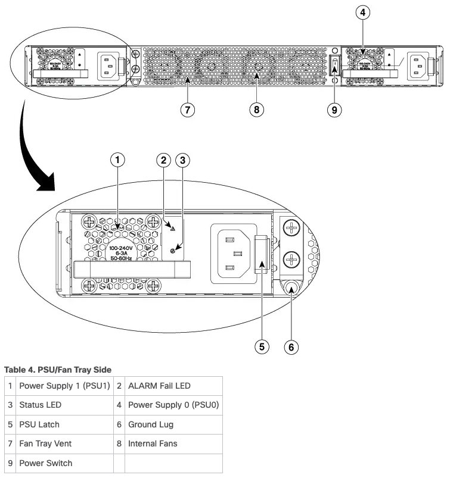
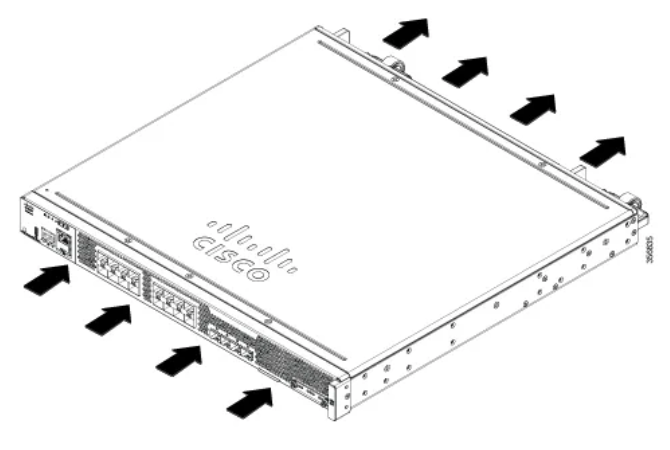

# Table of Contents
* [Reference](#reference)
* [Hardware chassis overview](#hardware-chassis-overview)
  * [Front Chassis](#front-chassis)
  * [Back Chassis](#back-chassis)
  * [Airflow](#airflow)
* [Interfaces](#interfaces)

---

# Reference

> [Hardware Installation Guide for Cisco Catalyst 8500L-8S4X Edge Platform](https://www.cisco.com/c/en/us/td/docs/routers/cloud_edge/c8500l/b-catalyst-8500L-8S4X-edge-platform-hig/m-overview_85L.html)
>
> [Download PDF](./b-catalyst-8500L-8S4X-edge-platform-hig.pdf)


# Hardware chassis overview

## Front Chassis


## Back Chassis


# Airflow
- [x] Front to back
- [ ] Back to Front
- [ ] Side to Side



# Interfaces
```config
interface GigabitEthernet0/0/0
 no ip address
 shutdown
 negotiation auto
!
interface GigabitEthernet0/0/1
 no ip address
 shutdown
 negotiation auto
!
interface GigabitEthernet0/0/2
 no ip address
 shutdown
 negotiation auto
!
interface GigabitEthernet0/0/3
 no ip address
 shutdown
 negotiation auto
!
interface GigabitEthernet0/0/4
 no ip address
 shutdown
 negotiation auto
!
interface GigabitEthernet0/0/5
 no ip address
 shutdown
 negotiation auto
!
interface GigabitEthernet0/0/6
 no ip address
 shutdown
 negotiation auto
!
interface GigabitEthernet0/0/7
 no ip address
 shutdown
 negotiation auto
!
interface TenGigabitEthernet0/1/0
 no ip address
 shutdown
 negotiation auto
!
interface TenGigabitEthernet0/1/1
 no ip address
 shutdown
 negotiation auto
!
interface TenGigabitEthernet0/1/2
 no ip address
 shutdown
 negotiation auto
!
interface TenGigabitEthernet0/1/3
 no ip address
 shutdown
 negotiation auto
!
interface GigabitEthernet0
 vrf forwarding Mgmt-intf
 no ip address
 negotiation auto