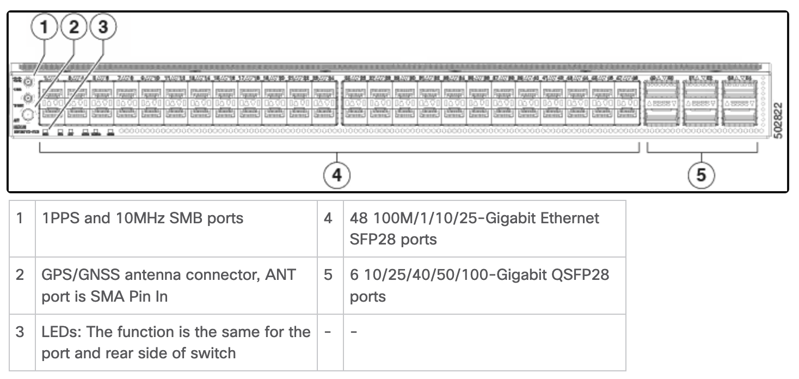
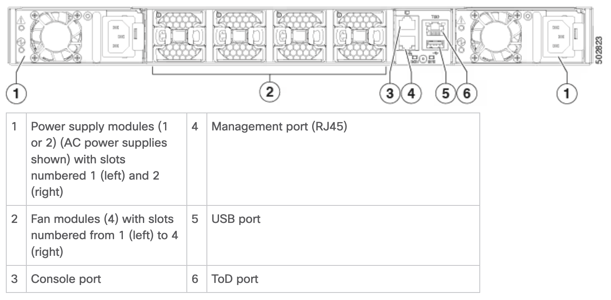
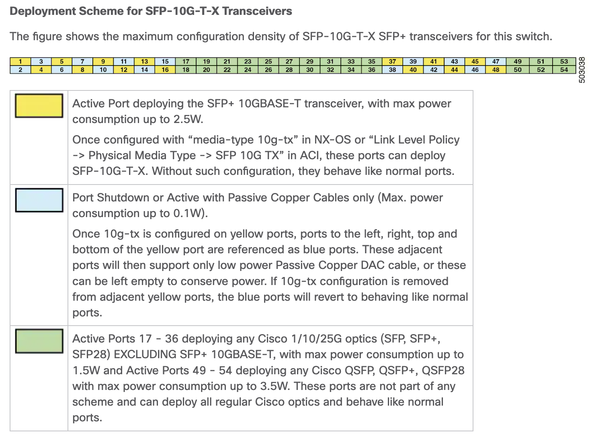

# Table of Contents
* [Reference](#reference)
* [Hardware chassis overview](#hardware-chassis-overview)
  * [Front Chassis](#front-chassis)
  * [Back Chassis](#back-chassis)
  * [Airflow](#airflow)
* [Interfaces](#interfaces)

---

# Reference

> [Cisco Nexus 93180YC-FX3 ACI-Mode Switch Hardware Installation Guide](https://www.cisco.com/c/en/us/td/docs/dcn/hw/aci/nexus9000/93180yc-fx3s/cisco-nexus-93180yc-fx3-aci-mode-switch-hardware-installation-guide/m_overview1.html)
>
> [Download PDF](./cisco-nexus-93180yc-fx3-aci-mode-switch-hardware-installation-guide.pdf)


# Hardware chassis overview

## Front Chassis


## Back Chassis


# Airflow
- [x] Front to back
- [x] Back to Front
- [ ] Side to Side

## Fan modules (four) with these airflow choices:

- Port-side exhaust fan module with blue coloring (NXA-FAN-35CFM-PE)
- Port-side intake fan module with burgundy coloring (NXA-FAN-35CFM-PI)

# Interfaces

## Special Port Support for SPF+ 10GBase-T



```config
interface Ethernet1/1

interface Ethernet1/2

interface Ethernet1/3

interface Ethernet1/4

interface Ethernet1/5

interface Ethernet1/6

interface Ethernet1/7

interface Ethernet1/8

interface Ethernet1/9

interface Ethernet1/10

interface Ethernet1/11

interface Ethernet1/12

interface Ethernet1/13

interface Ethernet1/14

interface Ethernet1/15

interface Ethernet1/16

interface Ethernet1/17

interface Ethernet1/18

interface Ethernet1/19

interface Ethernet1/20

interface Ethernet1/21

interface Ethernet1/22

interface Ethernet1/23

interface Ethernet1/24

interface Ethernet1/25

interface Ethernet1/26

interface Ethernet1/27

interface Ethernet1/28

interface Ethernet1/29

interface Ethernet1/30

interface Ethernet1/31

interface Ethernet1/32

interface Ethernet1/33

interface Ethernet1/34

interface Ethernet1/35

interface Ethernet1/36

interface Ethernet1/37

interface Ethernet1/38

interface Ethernet1/39

interface Ethernet1/40

interface Ethernet1/41

interface Ethernet1/42

interface Ethernet1/43

interface Ethernet1/44

interface Ethernet1/45

interface Ethernet1/46

interface Ethernet1/47

interface Ethernet1/48

interface Ethernet1/49

interface Ethernet1/50

interface Ethernet1/51

interface Ethernet1/52

interface Ethernet1/53

interface Ethernet1/54

interface mgmt0
  vrf member management
```
